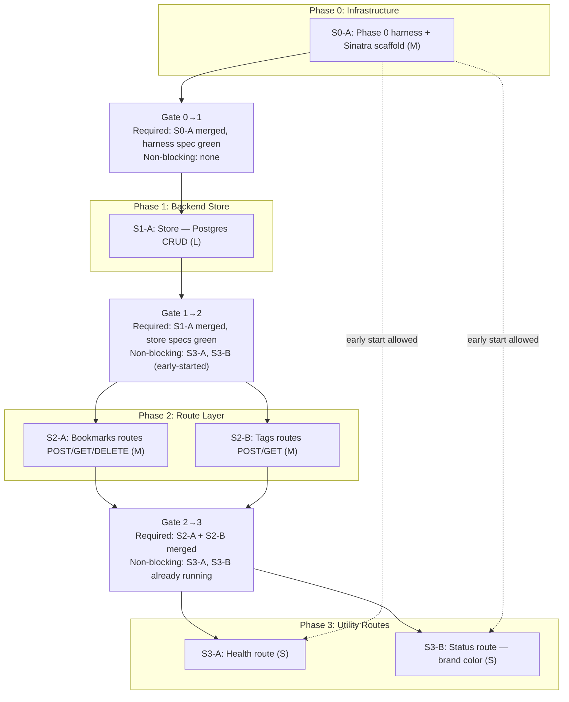

```mermaid
graph TD

subgraph Phase0["Phase 0: Infrastructure"]
    S0A["S0-A: Phase 0 harness + Sinatra scaffold (M)"]
end

GATE0["Gate 0→1\nRequired: S0-A merged, harness spec green\nNon-blocking: none"]

subgraph Phase1["Phase 1: Backend Store"]
    S1A["S1-A: Store — Postgres CRUD (L)"]
end

GATE1["Gate 1→2\nRequired: S1-A merged, store specs green\nNon-blocking: S3-A, S3-B (early-started)"]

subgraph Phase2["Phase 2: Route Layer"]
    S2A["S2-A: Bookmarks routes POST/GET/DELETE (M)"]
    S2B["S2-B: Tags routes POST/GET (M)"]
end

GATE2["Gate 2→3\nRequired: S2-A + S2-B merged\nNon-blocking: S3-A, S3-B already running"]

subgraph Phase3["Phase 3: Utility Routes"]
    S3A["S3-A: Health route (S)"]
    S3B["S3-B: Status route — brand color (S)"]
end

S0A --> GATE0
GATE0 --> S1A
S1A --> GATE1
GATE1 --> S2A
GATE1 --> S2B
S2A --> GATE2
S2B --> GATE2
GATE2 --> S3A
GATE2 --> S3B

S0A -.->|"early start allowed"| S3A
S0A -.->|"early start allowed"| S3B
```