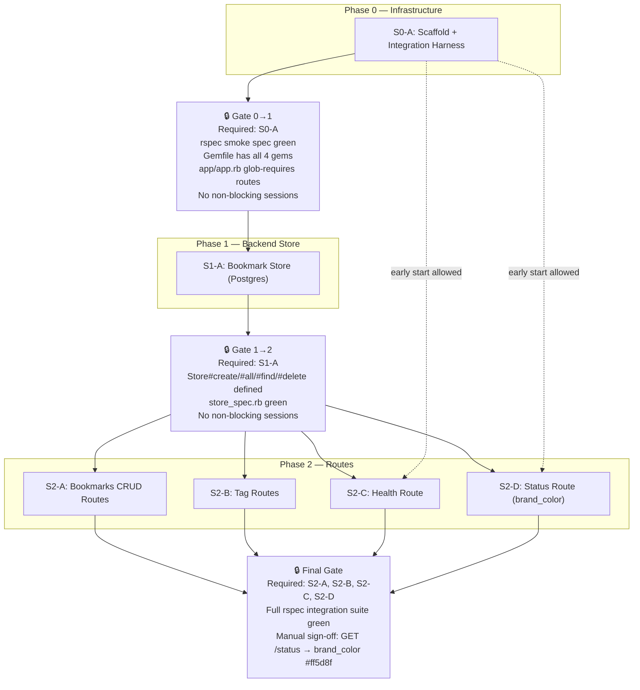

```mermaid
graph TD

subgraph Phase0["Phase 0 — Infrastructure"]
    S0A["S0-A: Scaffold + Integration Harness"]
end

GATE01["🔒 Gate 0→1\nRequired: S0-A\nrspec smoke spec green\nGemfile has all 4 gems\napp/app.rb glob-requires routes\nNo non-blocking sessions"]

subgraph Phase1["Phase 1 — Backend Store"]
    S1A["S1-A: Bookmark Store (Postgres)"]
end

GATE12["🔒 Gate 1→2\nRequired: S1-A\nStore#create/#all/#find/#delete defined\nstore_spec.rb green\nNo non-blocking sessions"]

subgraph Phase2["Phase 2 — Routes"]
    S2A["S2-A: Bookmarks CRUD Routes"]
    S2B["S2-B: Tag Routes"]
    S2C["S2-C: Health Route"]
    S2D["S2-D: Status Route (brand_color)"]
end

GATEFINAL["🔒 Final Gate\nRequired: S2-A, S2-B, S2-C, S2-D\nFull rspec integration suite green\nManual sign-off: GET /status → brand_color #ff5d8f"]

S0A --> GATE01
GATE01 --> S1A
S1A --> GATE12
GATE12 --> S2A
GATE12 --> S2B
GATE12 --> S2C
GATE12 --> S2D

S0A -.->|"early start allowed"| S2C
S0A -.->|"early start allowed"| S2D

S2A --> GATEFINAL
S2B --> GATEFINAL
S2C --> GATEFINAL
S2D --> GATEFINAL
```